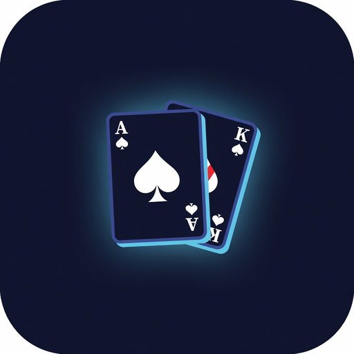

# Blackjack

<p align="center">
  
</p>

<p align="center"><strong>Quiet table. Dense engine. Web3 when you need it.</strong></p>

**Aesthetic:** under-the-hood presence — Digital Sea void field, glass, mono stats. Not casino neon. Brand mark: Ace–King fan (see [`branding/`](branding/)).

A single-purpose blackjack client: play, read the shoe, settle the hand. The UI stays out of the way. Everything that matters lives **under the hood** — real multi-deck composition, exact next-hit math, full rule surface, wallet-native identity, and a native shell when you want it off the browser.

Not a multi-game lobby. One felt, one hand, maximum legibility.

---

## Surface vs engine

| What you see | What’s actually running |
|--------------|-------------------------|
| One felt, one hand at a time | Multi-deck shoe with true remaining composition |
| Hit / stand / bet / bankroll | Exact soft/hard totals, naturals, settle phases |
| Odds you can read in one glance | Combinatorial P(bust on next hit) from cards left |
| Connect wallet · optional GitHub | SIWE path (RainbowKit + WalletConnect), session work ahead |
| Quiet motion, glass, mono stats | Tokenized design system, Capacitor iOS/Android shell |

**Maximum utility for blackjack only.** No roulette, no poker, no social feed, no gamified spam. If a feature does not improve how you play, read, or settle a hand (or how you own your session on-chain), it does not belong here.

---

## Design principles

1. **Simple UI, comprehensive engine** — Fewer controls; deeper correctness. Players should never fight the chrome.
2. **Legibility first** — Totals, soft flags, bankroll, bet, shoe depth, and bust % stay scannable. Mono for numbers. Hierarchy over decoration.
3. **Honest math** — Bust % is exact from remaining cards, not vibes. Do not claim full basic-strategy EV until that table actually ships.
4. **Quiet craft** — Press feedback, short durations, interruptible motion. No slot-machine chaos.
5. **Web3 without cosplay** — Wallet connect is identity and future cash rails. The game is still blackjack; the chain is not the gimmick.
6. **Scope lock** — Features must be *about blackjack* (rules, shoe, odds, bankroll, settle, identity tied to play). Reject everything else.

---

## What ships today (v0.3)

### Table

- Multi-deck shoe (default 6), shuffle, deal, hit, stand, settle, next hand
- Full action surface: **double, split (to 4 hands), insurance / even money, late surrender**
- Rule config panel: decks, H17/S17, 3:2 vs 6:5, double policy, DAS, split-ace rules, surrender, insurance, penetration
- Cut-card penetration reshuffle between rounds (no mid-hand corruption)
- Bankroll + chip bet selection, session stats (W/L/P, blackjacks, net), local persistence
- Dealer hole card hidden during player turn; dealer peeks on ten/ace
- Soft totals called out in the UI
- Natural blackjack detection in the engine

### Odds (odds-first)

- **Exact EV per action** — full expectimax over the live unseen composition, memoized with depletion: stand, hit (optimal continuation), double, and surrender are exact; split uses the standard independence approximation and is labeled ≈
- **P(bust on hit)** and **exact dealer outcome distribution** — P(17…21, bust), post-peek conditional
- **Player-perspective pool** — all odds draw from shoe + hidden hole card, the exact unseen set from the player's seat
- **Insurance callout** — exact P(dealer blackjack) vs the 33.3% breakeven, labeled +EV/−EV
- **Play grading** — every decision is graded against the exact solve; hand history logs mistakes and EV given up, with session accuracy
- **Hi-Lo running / true count** (toggle)
- **Basic-strategy chart** shown when it disagrees with the exact composition — the teaching moment is the point

### Identity (web3)

- RainbowKit connect (dark, under-the-hood theme)
- WalletConnect project id via env
- GitHub entry reserved (NextAuth wiring next)
- SIWE session cookie + server verify planned

### Shell & craft

- Next.js 15 + React 19 + TypeScript
- Design tokens in `src/styles/sea.css` (void / glass / accent)
- Capacitor config for iOS / Android native wrap
- Agent skills for interface craft + motion polish (`.agents/skills/`)

---

## Roadmap (blackjack-only)

Everything below stays inside the game. No product sprawl.

| Priority | Feature | Status |
|----------|---------|--------|
| Done | Double down (two-card, 1 card, 2× stake) | ✅ Engine + UI |
| Done | Design system (`.agents/DESIGN.md` + sea tokens, Emil/Apple motion) | ✅ |
| Done | Settle banners, bust meter, focus-visible, reduced-motion | ✅ |
| Done | Structured `result` tone; rebuy / all-in; bust via settle() | ✅ |
| Done | Client SIWE verifyMessage + chainId; WC demo Cloud id | ✅ (server still next) |
| Done | Split (true multi-hand), insurance / even money, late surrender | ✅ Engine + UI |
| Done | Rule config (decks, H17/S17, payout, DAS, double policy, split aces, surrender, penetration) | ✅ |
| Done | Penetration / cut card reshuffle policy | ✅ |
| Done | Exact dealer distribution + stand EV; Hi-Lo count | ✅ Combinatorial, post-peek conditional |
| Done | Basic-strategy chart advisor (H17/S17, DAS, LS aware) | ✅ Labeled as chart |
| Done | Session stats (W/L/P, BJ, net) + local persistence | ✅ |
| Done | **Full composition-dependent EV per action** | ✅ Exact hit/stand/double/surrender; split ≈ (labeled) |
| Done | Hand history + play grading (EV vs exact solve) | ✅ Mistakes, accuracy, EV given up |
| Done | Player-perspective unseen pool (shoe + hole) | ✅ Correctness fix for all odds |
| Done | Simulation harness (`npm run sim`) + GitHub Actions CI | ✅ Typecheck, tests, sim smoke, build |
| Next | Full SIWE session (cookie + server verify) | Blocked by static export (Capacitor); needs a server deploy target |
| Next | On-chain buy-in / cashout | Bankroll that can leave the browser |
| Later | Exact split EV (resplit-aware joint solve) | Replace the ≈ when tractable |
| Later | Sound / haptics on native shell | Capacitor haptics, quiet by default |

**Out of scope forever (examples):** other casino games, NFT mint spam, generic DeFi dashboard, non-blackjack chrome.

---

## Stack

| Layer | Choice |
|-------|--------|
| App | Next.js 15, React 19, TypeScript |
| Chain UI | wagmi, viem, RainbowKit |
| Table engine | `src/lib/shoe.ts` — shoe, rules, multi-hand phases, exact odds · `src/lib/ev.ts` — exact EV solver · `src/lib/strategy.ts` — chart · `src/lib/history.ts` — grading |
| Design | CSS tokens — `src/styles/sea.css` |
| Native | Capacitor 7 (iOS / Android) |

---

## Setup

```bash
cd Laboratory/blackjack   # or your clone path
npm install

# optional — WalletConnect Cloud project id for wallet UX
# echo NEXT_PUBLIC_WC_PROJECT_ID=your_id > .env.local

npm run dev

# verify
npm test          # engine + solver suites
npm run sim       # 20k-hand edge simulation (solver policy)
npm run sim -- 20000 chart
```

Open [http://localhost:3000](http://localhost:3000).

### Native (optional)

```bash
npm run cap:ios      # build + sync + open Xcode
npm run cap:android  # build + sync + open Android Studio
```

---

## Repo map

```
src/
  app/           # layout, home shell
  components/    # Table, AuthBar, Providers
  lib/           # shoe, ev solver, history grading, strategy chart, wagmi
  styles/        # sea.css — materials & tokens
scripts/         # sim.ts — edge simulation harness
.github/         # CI (typecheck, tests, sim smoke, build)
public/          # logo.svg, icon.svg
capacitor.config.ts
.agents/         # agent memory + design/motion skills
```

| Asset | Use |
|-------|------|
| `public/logo.svg` | App / OG mark |
| `public/icon.svg` | Compact mark / favicon-style |

Agent conventions: `.agents/memory/AGENTS.md`

---

## Product rules (short)

- **Presence** — Under-the-hood aesthetic; tokens live in CSS. This app is *only* blackjack.
- **Auth** — SIWE via RainbowKit + WalletConnect; GitHub as secondary path.
- **Math** — Prefer exact composition-dependent combinatorics (player-perspective pool); never fake EV. Split EV is labeled ≈ until a joint resplit solve ships.
- **Motion** — Smooth, quiet, interruptible — not casino neon.
- **Scope** — If it is not blackjack utility or session rails for play, cut it.

---

## Status

- [x] Project scaffold + under-the-hood theme
- [x] Multi-deck shoe, hit / stand, settle, bankroll
- [x] Odds panel: P(bust on next hit) from remaining cards
- [x] RainbowKit connect (dark theme)
- [x] Capacitor shell hooks (iOS / Android)
- [x] GitHub button (placeholder for NextAuth)
- [x] Double / split / insurance / surrender
- [x] Rule config (H17/S17, DAS, surrender, decks, payout, penetration)
- [x] Exact dealer distribution + stand EV; Hi-Lo count; chart advisor
- [x] Session stats + persistence
- [x] Full composition-dependent EV per action (split ≈, labeled)
- [x] Hand history + play grading; sim harness; CI
- [ ] Full SIWE session cookie + server verify (needs non-static deploy)
- [ ] On-chain buy-in / cashout

---

Built for people who want a **clean table** and a **serious engine** — web3 identity included, spectacle excluded.
